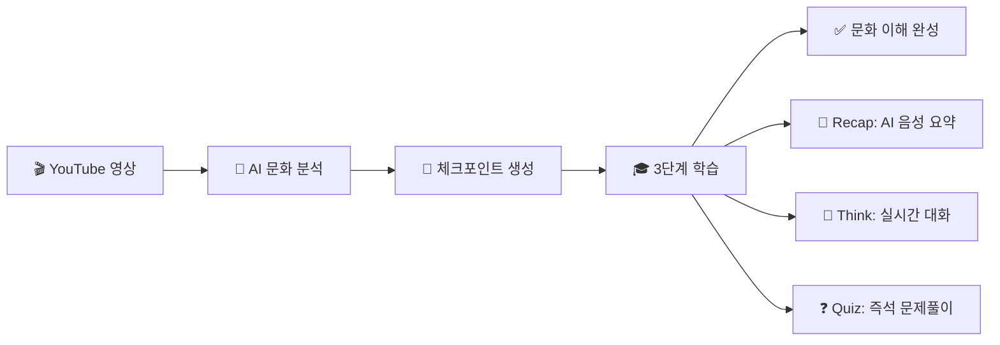

# Kaption (캡션) 🎬

## 자막을 넘어, K-콘텐츠와 직접 소통하며 배우는 문화 학습 AI

****

*2025 서울 AI 해커톤 - 주제1: 활력있고 매력적인 글로벌 선도도시*


## 🌟 프로젝트 개요
Kaption은 K-콘텐츠를 시청하는 전 세계 사용자들이 한국 문화의 깊은 맥락을 이해할 수 있도록 돕는 Chrome Extension입니다. AI가 실시간으로 문화적 뉘앙스를 분석하고, 대화형 학습 경험(Recap → Think → Quiz)을 통해 자연스럽고 몰입감 있는 문화 교육을 제공합니다.

## ✨ 핵심 기능

### 🎯 실시간 문화 맥락 분석
- **AI 기반 체크포인트 감지**: AI가 영상 속 한국 문화 요소를 실시간 분석
- **설명 포인트 추출**: 형/언니, 존댓말, 김치 등 핵심 문화 포인트를 설명
- **개인화된 설명**: 사용자의 한국어 수준과 관심사에 맞춘 맞춤형 문화 해설

### 🎓 3단계 대화형 학습
- **Recap(요약)**: AI 음성으로 문화 맥락을 친근하게 요약 설명
- **Think(토론)**: 실시간 WebRTC 대화로 깊이 있는 문화 이해 확장
- **Quiz(퀴즈)**: 즉석 피드백과 힌트로 재미있는 학습 완성

### 🎨 몰입형 사용자 경험
- **Chrome Side Panel**: 컨텐츠 시청 중 끊김 없는 학습 플로우
- **AI 튜터**: OpenAI Realtime API를 통한 자연스러운 음성 상호작용

## 🛠️ 기술 스택

### Frontend (Chrome Extension MV3)
```
React 18 + TypeScript    │ 컴포넌트 기반 UI 개발
TailwindCSS + Framer     │ 반응형 디자인 + 애니메이션  
WebRTC + DataChannel     │ OpenAI Realtime API 실시간 음성 통신
Chrome APIs              │ Side Panel + Service Worker
```

### Backend (FastAPI)
```
Python 3.12 + Uvicorn   │ FastAPI 서버
Google Gemini 2.5       │ 영상 컨텐츠 분석
OpenAI Realtime         │ 자연스러운 TTS/STT를 통한 AI 튜터와의 상호작용
Pydantic v2             │ 데이터 스키마 관리
```

### AI & Infrastructure
```
Google GenAI            │ YouTube 영상 문화 요소 분석
OpenAI Realtime API     │ WebRTC 기반 실시간 음성 생성
Chrome Web Store        │ 확장 배포 및 자동 업데이트
```

## 🚀 작동 원리



### 📊 학습 플로우
1. **영상 감지**: YouTube에서 한국 콘텐츠 시청 시 AI가 자동으로 문화 요소 분석
2. **체크포인트 생성**: 타임스탬프별로 핵심 문화 키워드와 설명 카드 생성  
3. **3단계 학습**: Recap → Think → Quiz 순서로 자연스러운 학습 경험 제공
4. **실시간 피드백**: 음성 대화와 즉석 채점으로 몰입감 있는 상호작용

### 🎯 타겟 사용자
- **K-콘텐츠 팬**: K-pop, K-drama 등을 즐기는 전 세계 시청자
- **한국어 학습자**: 실제 맥락에서 문화와 언어를 동시에 학습하고 싶은 사용자  
- **문화 교육자**: 한국 문화를 가르치는 교사 및 교육 기관

## 디렉토리 구조(요약)
```
Kaption/
├─ chrome-extension/
│  ├─ src/
│  │  ├─ components/ContentPage/
│  │  │  ├─ ContentModule.tsx     # 카드(요약) 컴포넌트
│  │  │  ├─ DeepDiveModal.tsx     # 모달(Recap/Think/Quiz) 메인 UI
│  │  │  └─ HoverOverlay.tsx
│  │  ├─ pages/ContentPage.tsx    # 카드 리스트 + 모달 진입 관리
│  │  ├─ services/tts.ts          # Realtime TTS/WebRTC 유틸(이벤트 훅 포함)
│  │  └─ services/chromeVideo.ts  # 백엔드 API 호출/스토리지 유틸
│  └─ tailwind.config.js
├─ kaption-backend/
│  └─ app/api/server.py           # FastAPI 진입점(Realtime 세션 토큰 프록시 등)
└─ README.md
```

## 설치 및 실행
### 1) 백엔드(FastAPI)
1. 환경설정
   - `.env`에 OpenAI 키 설정
     - `OPENAI_API_KEY=sk-...`
2. 의존성 설치 & 실행
   ```bash
   cd kaption-backend
   pip install -r requirements.txt
   uvicorn app.api.server:app --host 0.0.0.0 --port 8000 --reload
   ```
3. 엔드포인트
   - `POST /api/tts/session-token` → OpenAI Realtime 세션 발급 프록시
   - (기타) 분석/배치 엔드포인트는 서비스 요구사항에 맞춰 확장

### 2) 프론트엔드(Chrome Extension)
1. 의존성 설치
   ```bash
   cd chrome-extension
   yarn install
   ```
2. 개발/빌드
   - CRA/Vite 기반이라면 개발 서버/빌드 스크립트를 사용하세요.
   - 크롬 확장 빌드 후, **Chrome → 확장 프로그램 → 개발자 모드 → 압축해제된 확장 프로그램 로드**로 `build/` 또는 `dist/` 폴더를 등록

## 환경 변수
- **백엔드**
  - `OPENAI_API_KEY`: OpenAI Realtime 및 기타 API 호출에 사용
  - `GOOGLE_API_KEY`: Google Gemini API 키 (영상 분석용)
- **프론트엔드**
  - 기본적으로 `http://localhost:8000`의 백엔드로 토큰 요청


## 🎯 기대 효과

### 🌍 글로벌 K-콘텐츠 접근성 향상
- 전 세계 시청자들이 언어 장벽 없이 한국 문화 이해
- 실시간 AI 분석으로 놓치기 쉬운 문화적 뉘앙스까지 학습 가능

### 🎓 기존에 없던 문화 교육 방식
- 기존 자막/번역을 넘어선 맥락 중심 학습
- AI 튜터와의 실시간 대화로 능동적 학습 참여 유도


## 🔄 로드맵

### Phase 1 (현재)
- [x] 기본 Chrome Extension 아키텍처 구축
- [x] Google Gemini 기반 문화 분석 파이프라인
- [x] OpenAI Realtime TTS/대화 시스템
- [x] 3단계 학습 플로우 (Recap → Think → Quiz)

### Phase 2 (계획)
- [ ] Function Calling 기반 상호작용 정합성 개선
- [ ] 대화 맥락 추적 및 학습 이력 관리
- [ ] 다국어 지원 (영어, 중국어, 일본어)
- [ ] 학습 진도 시각화 대시보드
---

